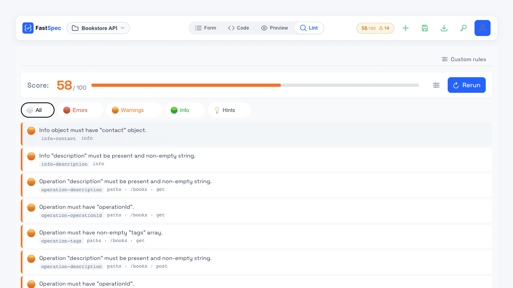
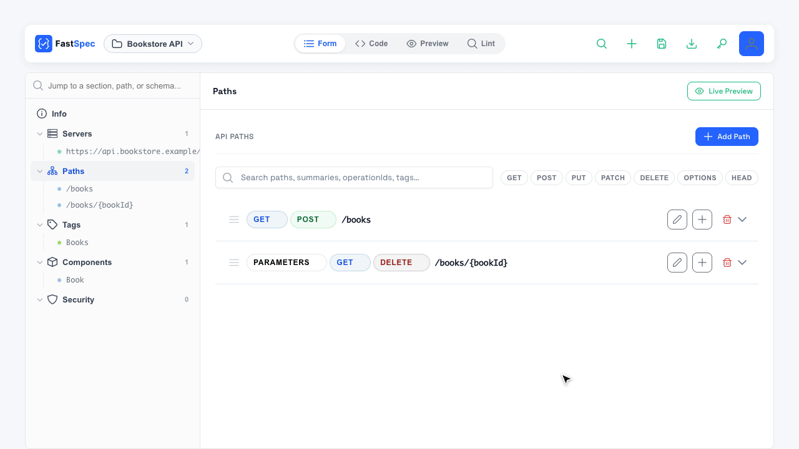
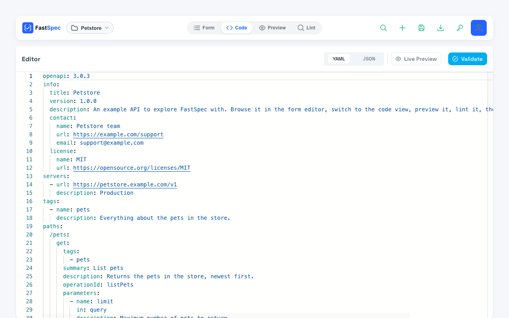
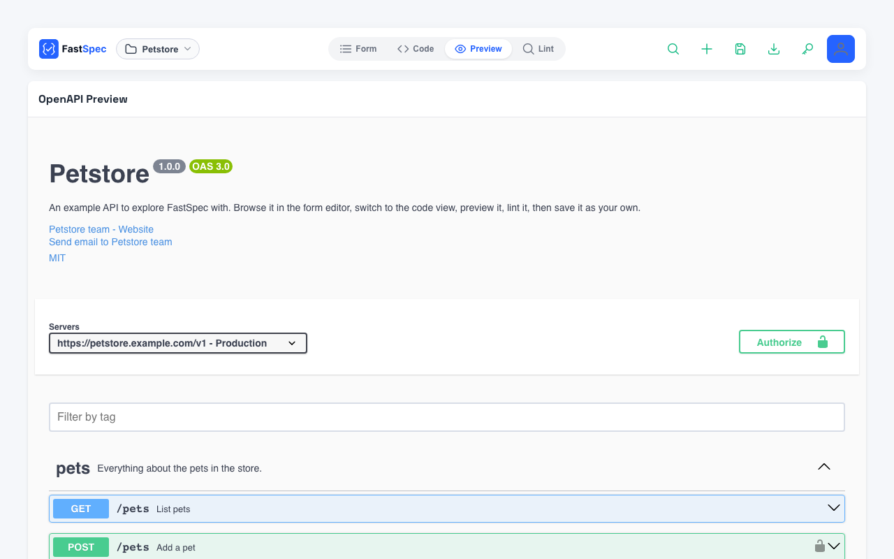

# FastSpec

A self-hostable editor for OpenAPI specifications: write specs in a form
editor or as YAML/JSON, preview them with Swagger UI, lint them with
Spectral, keep versions and diff them — and let AI agents work with them
over MCP.



- **Form editor and code editor** (Monaco, YAML or JSON) for OpenAPI 3.0
  and 3.1. Import existing files, download as YAML or JSON, or start from
  an example.
- **Live preview** with Swagger UI.
- **Linting** with [Spectral](https://github.com/stoplightio/spectral):
  the standard `spectral:oas` rules plus your own rulesets, per spec.
- **Versions and diffs**: save versions, compare any two, copy the diff as
  Markdown.
- **MCP server** so AI agents (Claude Code and other MCP clients) can read,
  write, version, lint and compare your specs, with scoped API keys.
- **Runs anywhere**: one Docker image, SQLite or Postgres, no sign-in for
  single-user setups, any OpenID Connect provider for teams.



| Code editor (YAML or JSON) | Swagger UI preview |
|---|---|
|  |  |

## Quickstart

```bash
docker run -d --name fastspec \
  -p 127.0.0.1:8080:8080 \
  -v fastspec-data:/data \
  ghcr.io/kaseovo/fastspec:latest
```

Open <http://localhost:8080>. That's it: single-user mode, data stored in
the `fastspec-data` volume.

For teams — Postgres, sign-in with Google/Keycloak/Authentik/Okta/Entra/
GitLab, running behind a reverse proxy — see
**[docs/SELF_HOSTING.md](docs/SELF_HOSTING.md)**.

## Connect an AI agent

Create an API key in the app (key icon, **API keys**), then, for Claude
Code:

```bash
claude mcp add --transport http fastspec http://localhost:8080/mcp \
  --header "Authorization: Bearer <your API key>"
```

Any MCP client that supports streamable HTTP works the same way.

## Development

Requirements: Python 3.12, Node.js 22. Docker is only needed to build the
image.

```bash
make setup   # .venv + backend and frontend dependencies
make dev     # backend (auto-reload) + Vite → http://localhost:5173/specs/
make test    # backend (pytest) and frontend (vitest) suites
make help    # everything else
```

`make dev` runs in single-user mode with SQLite in `./.data`. To try
sign-in or Postgres locally, copy `.env.example` to `.env` and adjust it.

| Path | What's there |
|---|---|
| `backend/` | FastAPI app, MCP server (`fastmcp_server/`), Alembic migrations, tests |
| `frontend/` | Vue 3 + PrimeVue single-page app |
| `infra/` | AWS CDK stacks for the serverless deployment |
| `docs/` | Guides and architecture decision records (`docs/adr/`) |

The backend's interactive API docs are at `/docs` on a running instance.

## Documentation

- [Self-hosting](docs/SELF_HOSTING.md) — install, sign-in, Postgres, reverse proxy, MCP, backups, configuration
- [Authentication](docs/AUTHENTICATION.md) — sign-in modes, sessions, API keys
- [HTTP API](docs/API.md) — base paths and authentication (full reference at `/docs` on any instance)
- [Custom lint rules](docs/CUSTOM_LINT_RULES.md)
- [Deployment](docs/DEPLOYMENT.md) — including the AWS serverless setup
- [Architecture](docs/ARCHITECTURE.md), [glossary](CONTEXT.md) and [decisions](docs/adr/)
- [Contributing](CONTRIBUTING.md), [releasing](docs/RELEASING.md), [changelog](CHANGELOG.md), [roadmap](docs/ROADMAP.md)

## Hosted version

FastSpec also runs as a hosted service at
[fastspec.kaseovo.com](https://fastspec.kaseovo.com), if you'd rather not
run it yourself.

## License

[GNU Affero General Public License v3.0](LICENSE). You can use, modify and
self-host FastSpec freely; if you offer a modified version to others over a
network, you must make your changes available under the same license.
