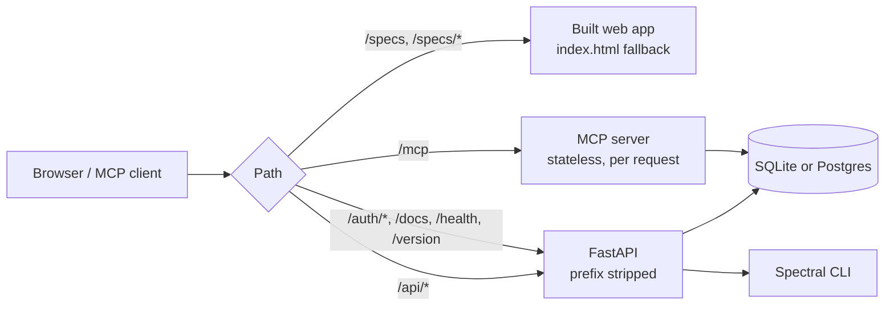
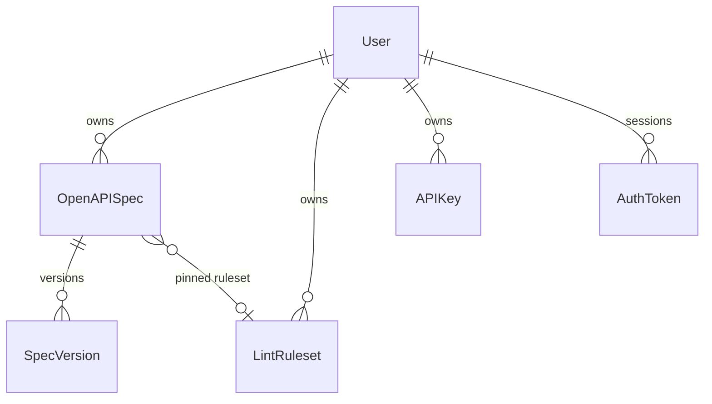

# Architecture

FastSpec is one Python backend (FastAPI + an MCP server) and one Vue
single-page app, served from a single origin. This page is the map; the
*why* behind the bigger choices lives in the [ADRs](adr/), and domain terms
are defined in [CONTEXT.md](../CONTEXT.md).

## Request routing

Everything is served from one origin, so the session, the sign-in cookie
and the app never cross origins.

- **Self-hosted** (`Dockerfile`): `backend/frontdoor.py` does this routing
  inside the app; `/` redirects to `/specs/`.
- **AWS** ([DEPLOYMENT.md](DEPLOYMENT.md)): CloudFront does it — `/specs*`
  from S3, `/api*`, `/auth*`, `/mcp*` to the Lambda (same `frontdoor.py`,
  without the SPA), everything else to your website bucket.
- **Development** (`make dev`): Vite serves the app and proxies `/api`,
  `/auth` and `/mcp` to the backend.

See [ADR-0008](adr/0008-single-image-self-hosting.md).

## Backend (`backend/`)

Python 3.12, FastAPI, SQLAlchemy 2, Alembic, FastMCP. Layers: routers
translate HTTP; services hold the business rules and own commits;
repositories wrap multi-row persistence.

| Path | Role |
|---|---|
| `app.py` | The ASGI application: FastAPI + MCP behind the front door. Used by uvicorn and by Mangum on Lambda. |
| `frontdoor.py` | Single-origin routing (table above) and SPA file serving. |
| `main.py` | FastAPI app, routers, health checks, `/version`. |
| `config.py` | All settings (`pydantic-settings`, repo-root `.env`), start-up validation. |
| `database.py`, `base.py`, `models.py` | Engine/session (SQLite or Postgres), declarative base, ORM models. |
| `schemas.py` | Pydantic request/response models. |
| `routers/` | `auth.py` (sign-in, sessions, API keys), `specs.py` (specs, versions, diff), `lint.py` (linting, rulesets). |
| `services/` | `spec_service.py`, `spec_version_service.py`, `lint_service.py`, `lint_ruleset_repository.py`. |
| `validation/` | `validator.py` (OpenAPI validation), `spectral_client.py` / `spectral_linter.py` (Spectral), `diff_utils.py` (version diffs). |
| `auth/` | `oidc.py` (OpenID Connect), `users.py` (local user, account matching), `jwt.py` (sessions, API keys, short JWTs), `dependencies.py` (`get_current_user`). |
| `fastmcp_server/` | MCP tools, API-key authentication and per-tool authorization. |
| `permissions.py`, `rate_limit.py` | API-key actions; per-IP rate limiting. |
| `alembic/` | Migrations — must work on SQLite and Postgres ([ADR-0007](adr/0007-sqlite-and-postgres.md)). |
| `cli.py` | `serve` (migrate + uvicorn), `migrate`, `transfer-local-data`. |
| `lambda_handler.py`, `migrate.py` | AWS Lambda entry point and its migration path. |

### Data model

- **OpenAPISpec** — name and the current version label; the content lives
  in **SpecVersion** rows (one JSON document per version label).
- **LintRuleset** — a user's named Spectral rulesets; one is the default,
  and a spec can pin another ([ADR-0005](adr/0005-multi-ruleset-lint.md)).
- **APIKey** — hashed long-lived key with a set of actions.
- **AuthToken** — one row per session JWT (`jti`), so sessions can be
  revoked. The token itself isn't stored.
- **User** — keyed on `(provider, provider_user_id)`: `local` in
  single-user mode, the OIDC issuer's key and `sub` otherwise.

### Authentication

`AUTH_MODE=none` (single user) or `oidc` (any OpenID Connect provider),
session JWTs for the web app, API keys for MCP clients. See
[AUTHENTICATION.md](AUTHENTICATION.md) and
[ADR-0006](adr/0006-auth-modes.md).

### Linting

`LintService` resolves which ruleset applies (the spec's pinned one, else
the user's default, else plain `spectral:oas`), writes a temporary Spectral
ruleset, and runs the Spectral CLI through the `SpectralClient` seam
(subprocess by default; an HTTP-sidecar transport exists). User-supplied
YAML is checked against an allowlist before it reaches Spectral. See
[CUSTOM_LINT_RULES.md](CUSTOM_LINT_RULES.md).

### MCP server

`fastmcp_server/server.py` defines the tools; they reuse the same services
as the HTTP API. Requests authenticate with an API key (or the short JWT it
exchanges for), and each tool declares the actions it needs. The endpoint
is stateless: every request gets its own short-lived handler, which works
identically on uvicorn and Lambda.

## Frontend (`frontend/`)

Vue 3, PrimeVue 4, Pinia, Vite, Monaco (code editor), Swagger UI (preview).
Built with base path `/specs/`.

| Path | Role |
|---|---|
| `src/main.js` | Boots the app: restores the session, runs `auth/session.js`, then installs the router. |
| `src/auth/session.js` | Sign-in callback, `/auth/config`, single-user sessions, sign-out handling. |
| `src/api/` | `http.js` (axios client: session header, 401 handling) and the `auth`, `specs`, `lint`, `appInfo` modules. |
| `src/stores/auth.js` | Session and auth-mode state (Pinia). |
| `src/router/index.js` | `/specs`, `/specs/:id`, `/specs/:id/preview`. |
| `src/AppLayout.vue`, `src/views/` | Shell, sign-in screen, editor and preview pages. |
| `src/components/FormEditor.vue` + `form-editor/` | The form editor: info, servers, paths/operations, components, tags, security. |
| `src/components/EditorPanel.vue` | Monaco code editor. |
| `src/components/PreviewPanel.vue` | Swagger UI preview. |
| `src/components/LintPanel.vue`, `LintRulesetDialog.vue` | Lint results and ruleset editing. |
| `src/components/DiffDrawer.vue` + `diff-drawer/`, `SaveDialog.vue` | Versions, comparisons, saving. |
| `src/components/TokenManager.vue`, `UserProfile.vue` | API keys; user menu. |
| `src/composables/` | Editor state and logic (`useSpecEditor`, `usePathsEditor`, `useComponentsEditor`, `useLint`, …). |
| `src/utils/` | OpenAPI form helpers, client-side diff for unsaved changes, Markdown output. |

The form editor's tabs share one mutable `formData` object and edit fields
inside it; the extracted composables hold the logic, and characterization
tests pin their behaviour.

## Infrastructure (`infra/`)

AWS CDK (TypeScript) for the serverless deployment: RDS, the backend Lambda,
CloudFront + S3, ACM, and the wake/auto-stop stack. Deployment-specific
values come from context or environment variables. See
[DEPLOYMENT.md](DEPLOYMENT.md).

## Tests

| Where | What |
|---|---|
| `backend/tests/` | pytest. In-memory SQLite by default; migration tests also run on Postgres when `TEST_POSTGRES_URL` is set (CI). |
| `frontend/src/**/*.spec.js`, `*.test.js` | Vitest + Vue Test Utils in jsdom. |
| `infra/test/` | Jest + CDK assertions. |

CI (`.github/workflows/test.yml`) runs all three, ruff and ESLint, and
builds the Docker image with a smoke test.
