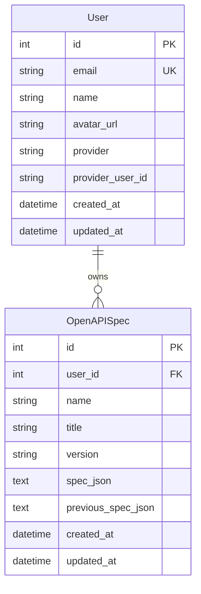
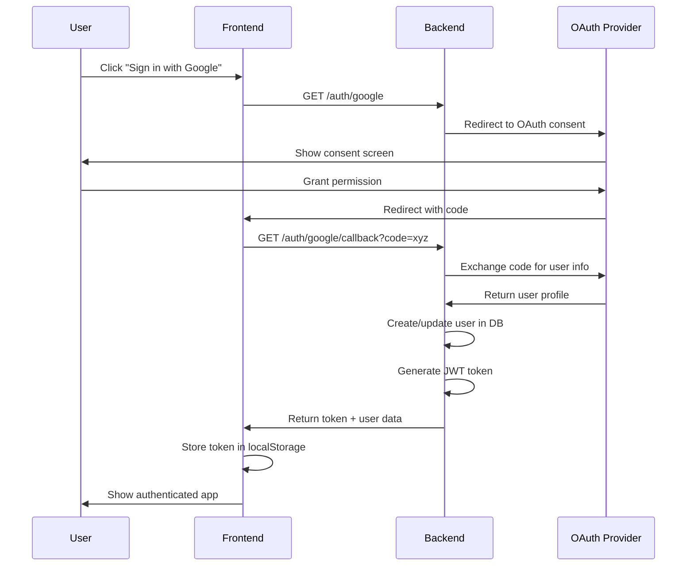
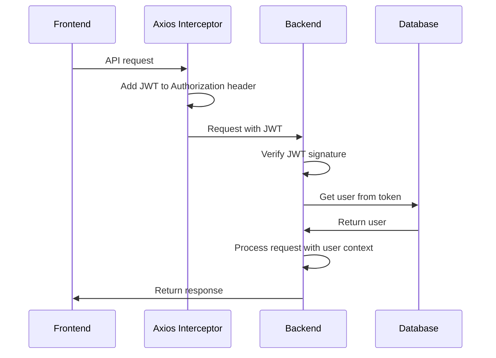

# FastSpec Authentication Implementation Plan

## Overview

Implement OAuth2 authentication with Google and GitHub providers to enable users to save and manage their private OpenAPI specifications securely.

## Architecture Decisions

### Authentication Strategy

- **OAuth2 with Social Providers**: Google and GitHub
- **JWT Tokens**: For session management
- **Private Specs**: Each user can only see and edit their own specifications
- **Library**: Authlib for OAuth2 implementation

### Tech Stack

- **Backend**: FastAPI + Authlib + PyJWT + SQLAlchemy
- **Frontend**: Vue 3 + Axios + Vue Router
- **Database**: SQLite (existing) with new User table

---

## Implementation Plan

### Phase 1: Backend Authentication Infrastructure

#### 1.1 Dependencies & Configuration

**Files to modify**: [`requirements.txt`](requirements.txt:1), [`.env.example`](.env.example:1)

Add required packages:

```python
authlib==1.3.1
pyjwt==2.8.0
python-jose[cryptography]==3.3.0
passlib[bcrypt]==1.7.4
```

Environment variables needed:

```bash
# JWT Configuration
JWT_SECRET_KEY=your-super-secret-jwt-key-change-in-production
JWT_ALGORITHM=HS256
JWT_EXPIRATION_MINUTES=43200  # 30 days

# OAuth2 - Google
GOOGLE_CLIENT_ID=your-google-client-id
GOOGLE_CLIENT_SECRET=your-google-client-secret
GOOGLE_REDIRECT_URI=http://localhost:3000/auth/google/callback

# OAuth2 - GitHub
GITHUB_CLIENT_ID=your-github-client-id
GITHUB_CLIENT_SECRET=your-github-client-secret
GITHUB_REDIRECT_URI=http://localhost:3000/auth/github/callback

# Frontend URL
FRONTEND_URL=http://localhost:3000
```

#### 1.2 Database Models

**New file**: [`backend/models.py`](backend/models.py:1) (modify existing)

Add User model:

```python
class User(Base):
    __tablename__ = "users"

    id = Column(Integer, primary_key=True, index=True)
    email = Column(String(255), unique=True, index=True, nullable=False)
    name = Column(String(255), nullable=True)
    avatar_url = Column(String(512), nullable=True)
    provider = Column(String(50), nullable=False)  # 'google' or 'github'
    provider_user_id = Column(String(255), nullable=False)
    created_at = Column(DateTime(timezone=True), server_default=func.now())
    updated_at = Column(DateTime(timezone=True), onupdate=func.now(), server_default=func.now())

    # Relationship to specs
    specs = relationship("OpenAPISpec", back_populates="owner", cascade="all, delete-orphan")
```

Modify OpenAPISpec model:

```python
class OpenAPISpec(Base):
    # ... existing fields ...
    user_id = Column(Integer, ForeignKey("users.id"), nullable=False)

    # Relationship to user
    owner = relationship("User", back_populates="specs")
```

#### 1.3 Pydantic Schemas

**New file**: [`backend/schemas.py`](backend/schemas.py:1) (modify existing)

Add authentication schemas:

```python
class UserBase(BaseModel):
    email: str
    name: Optional[str] = None
    avatar_url: Optional[str] = None

class UserResponse(UserBase):
    id: int
    provider: str
    created_at: datetime

    class Config:
        from_attributes = True

class Token(BaseModel):
    access_token: str
    token_type: str = "bearer"
    user: UserResponse

class TokenData(BaseModel):
    user_id: Optional[int] = None
    email: Optional[str] = None
```

#### 1.4 JWT Utilities

**New file**: [`backend/auth/jwt.py`](backend/auth/jwt.py:1)

Functions:

- `create_access_token(user_id: int, email: str) -> str`
- `verify_token(token: str) -> TokenData`
- `get_current_user(token: str, db: Session) -> User`

#### 1.5 OAuth2 Providers

**New file**: [`backend/auth/oauth.py`](backend/auth/oauth.py:1)

Setup Authlib OAuth registry:

- Google OAuth2 configuration
- GitHub OAuth2 configuration
- Helper functions for token exchange

#### 1.6 Authentication Dependencies

**New file**: [`backend/auth/dependencies.py`](backend/auth/dependencies.py:1)

FastAPI dependencies:

- `get_current_user()`: Extract and verify JWT from Authorization header
- `get_current_active_user()`: Ensure user exists in database

#### 1.7 Authentication Router

**New file**: [`backend/routers/auth.py`](backend/routers/auth.py:1)

Endpoints:

- `GET /auth/google` - Initiate Google OAuth flow
- `GET /auth/google/callback` - Handle Google callback
- `GET /auth/github` - Initiate GitHub OAuth flow
- `GET /auth/github/callback` - Handle GitHub callback
- `GET /auth/me` - Get current user info
- `POST /auth/logout` - Logout (client-side token removal)

#### 1.8 Update Specs Router

**File to modify**: [`backend/routers/specs.py`](backend/routers/specs.py:1)

Changes:

- Add `current_user: User = Depends(get_current_user)` to all endpoints
- Filter specs by `user_id` in list/get operations
- Set `user_id` when creating specs
- Verify ownership before update/delete operations

#### 1.9 Update Main Application

**File to modify**: [`backend/main.py`](backend/main.py:1)

- Import and include auth router
- Update CORS to handle credentials
- Add startup event to create admin user (optional)

---

### Phase 2: Frontend Authentication Implementation

#### 2.1 Authentication Store (State Management)

**New file**: [`frontend/src/stores/auth.js`](frontend/src/stores/auth.js:1)

Create composable for authentication state:

```javascript
import { ref, computed } from "vue";

const user = ref(null);
const token = ref(localStorage.getItem("token"));

export function useAuth() {
  const isAuthenticated = computed(() => !!token.value && !!user.value);

  const setAuth = (newToken, newUser) => {
    token.value = newToken;
    user.value = newUser;
    localStorage.setItem("token", newToken);
    localStorage.setItem("user", JSON.stringify(newUser));
  };

  const clearAuth = () => {
    token.value = null;
    user.value = null;
    localStorage.removeItem("token");
    localStorage.removeItem("user");
  };

  const initAuth = () => {
    const storedToken = localStorage.getItem("token");
    const storedUser = localStorage.getItem("user");
    if (storedToken && storedUser) {
      token.value = storedToken;
      user.value = JSON.parse(storedUser);
    }
  };

  return {
    user,
    token,
    isAuthenticated,
    setAuth,
    clearAuth,
    initAuth,
  };
}
```

#### 2.2 Authentication API Client

**New file**: [`frontend/src/api/auth.js`](frontend/src/api/auth.js:1)

Functions:

- `loginWithGoogle()` - Redirect to Google OAuth
- `loginWithGitHub()` - Redirect to GitHub OAuth
- `handleOAuthCallback(provider, code)` - Exchange code for token
- `getCurrentUser()` - Fetch current user data
- `logout()` - Clear auth state

#### 2.3 Axios Interceptors

**File to modify**: [`frontend/src/api/specs.js`](frontend/src/api/specs.js:1)

Add JWT token to requests:

```javascript
import axios from "axios";
import { useAuth } from "../stores/auth";

const api = axios.create({
  baseURL: "/api",
});

// Request interceptor to add JWT token
api.interceptors.request.use((config) => {
  const { token } = useAuth();
  if (token.value) {
    config.headers.Authorization = `Bearer ${token.value}`;
  }
  return config;
});

// Response interceptor to handle 401 errors
api.interceptors.response.use(
  (response) => response,
  (error) => {
    if (error.response?.status === 401) {
      const { clearAuth } = useAuth();
      clearAuth();
      window.location.href = "/login";
    }
    return Promise.reject(error);
  }
);
```

#### 2.4 Login Component

**New file**: [`frontend/src/components/LoginPage.vue`](frontend/src/components/LoginPage.vue:1)

Features:

- Welcome message
- "Sign in with Google" button
- "Sign in with GitHub" button
- Branded design matching FastSpec theme

#### 2.5 OAuth Callback Handler

**New file**: [`frontend/src/components/OAuthCallback.vue`](frontend/src/components/OAuthCallback.vue:1)

Responsibilities:

- Extract authorization code from URL
- Exchange code for JWT token
- Store token and user data
- Redirect to main app

#### 2.6 User Profile Component

**New file**: [`frontend/src/components/UserProfile.vue`](frontend/src/components/UserProfile.vue:1)

Display:

- User avatar
- User name and email
- Provider badge (Google/GitHub)
- Logout button

#### 2.7 Update App Component

**File to modify**: [`frontend/src/App.vue`](frontend/src/App.vue:1)

Changes:

- Add authentication check on mount
- Show login page if not authenticated
- Add user profile component to header
- Initialize auth state from localStorage

#### 2.8 Update Toolbar Component

**File to modify**: [`frontend/src/components/Toolbar.vue`](frontend/src/components/Toolbar.vue:1)

Add user profile dropdown in toolbar

#### 2.9 Protected Route Wrapper

**New file**: [`frontend/src/components/AuthGuard.vue`](frontend/src/components/AuthGuard.vue:1)

Component that:

- Checks authentication status
- Redirects to login if not authenticated
- Shows loading state during verification

---

### Phase 3: Configuration & Setup

#### 3.1 OAuth Provider Setup

**Google OAuth Setup:**

1. Go to Google Cloud Console
2. Create new project or select existing
3. Enable Google+ API
4. Create OAuth 2.0 credentials
5. Add authorized redirect URI: `http://localhost:3000/auth/google/callback`
6. Add to production: `https://yourdomain.com/auth/google/callback`

**GitHub OAuth Setup:**

1. Go to GitHub Settings > Developer Settings > OAuth Apps
2. Create new OAuth App
3. Set Authorization callback URL: `http://localhost:3000/auth/github/callback`
4. Add to production: `https://yourdomain.com/auth/github/callback`

#### 3.2 Environment Configuration

**Files to update**: [`.env.example`](.env.example:1), create `.env`

Add all OAuth credentials and JWT configuration

#### 3.3 Database Migration

**New file**: [`backend/migrations/add_users_and_ownership.py`](backend/migrations/add_users_and_ownership.py:1)

Migration script to:

1. Create users table
2. Add user_id column to openapi_specs
3. Create a default/system user for existing specs
4. Set foreign key constraints

---

### Phase 4: Testing & Documentation

#### 4.1 Testing Checklist

- [ ] User can sign in with Google
- [ ] User can sign in with GitHub
- [ ] JWT token is stored and used correctly
- [ ] User can only see their own specs
- [ ] User cannot access other users' specs
- [ ] Token refresh works correctly
- [ ] Logout clears all auth state
- [ ] Protected routes redirect to login
- [ ] OAuth callback handles errors gracefully

#### 4.2 Documentation

**New file**: [`docs/AUTHENTICATION.md`](docs/AUTHENTICATION.md:1)

Include:

- How to set up OAuth providers
- Environment variable configuration
- User flow diagrams
- Security considerations
- Troubleshooting guide

**Update file**: [`README.md`](README.md:1)

Add authentication setup instructions

---

## Security Considerations

1. **JWT Secrets**: Use strong, randomly generated secrets in production
2. **HTTPS**: Always use HTTPS in production for OAuth callbacks
3. **Token Expiration**: Set reasonable expiration times (30 days recommended)
4. **CORS**: Configure CORS properly with credentials
5. **SQL Injection**: Use SQLAlchemy parameterized queries (already implemented)
6. **XSS Protection**: Vue escapes HTML by default
7. **Token Storage**: localStorage is acceptable for this use case
8. **Rate Limiting**: Consider adding rate limiting to auth endpoints

---

## Database Schema Changes



---

## Authentication Flow Diagrams

### Login Flow



### API Request Flow



---

## File Structure After Implementation

```
backend/
├── auth/
│   ├── __init__.py
│   ├── jwt.py              # JWT utilities
│   ├── oauth.py            # OAuth provider config
│   └── dependencies.py     # FastAPI dependencies
├── routers/
│   ├── __init__.py
│   ├── auth.py            # Authentication endpoints (NEW)
│   └── specs.py           # Updated with auth
├── migrations/
│   └── add_users_and_ownership.py
├── models.py              # Updated with User model
├── schemas.py             # Updated with auth schemas
├── main.py               # Updated with auth router
└── database.py

frontend/
├── src/
│   ├── stores/
│   │   └── auth.js        # Auth state management (NEW)
│   ├── api/
│   │   ├── auth.js        # Auth API client (NEW)
│   │   └── specs.js       # Updated with interceptors
│   ├── components/
│   │   ├── LoginPage.vue       # Login screen (NEW)
│   │   ├── OAuthCallback.vue   # OAuth handler (NEW)
│   │   ├── UserProfile.vue     # User profile (NEW)
│   │   ├── AuthGuard.vue       # Route protection (NEW)
│   │   ├── App.vue            # Updated with auth check
│   │   └── Toolbar.vue        # Updated with profile
│   └── main.js           # Updated with auth init

docs/
└── AUTHENTICATION.md      # Auth documentation (NEW)

.env.example              # Updated with OAuth config
requirements.txt          # Updated with auth packages
```

---

## Migration Guide for Existing Users

Since this adds authentication to an existing app:

1. **Existing specs handling**: Create a migration script that assigns all existing specs to a default/system user
2. **Gradual rollout option**: Add a feature flag to enable/disable authentication
3. **Data preservation**: Ensure no spec data is lost during migration

---

## Next Steps

Once you approve this plan, I'll switch to Code mode to implement:

1. Backend authentication infrastructure first
2. Then frontend authentication components
3. Finally, integration testing and documentation

Would you like me to proceed with implementation, or would you like to discuss any modifications to this plan?
