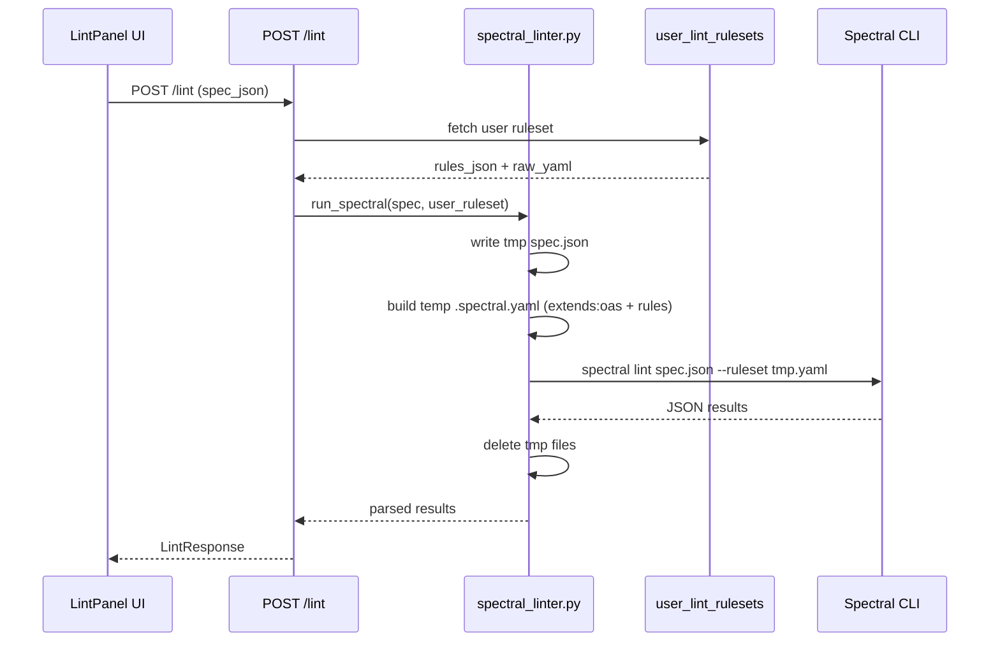

# Custom Lint Ruleset — Implementation Plan

## Decisions (from grilling session)

| Question | Decision |
|---|---|
| Ruleset scope | Per-User global (one ruleset for all Specs) |
| Authoring format | Structured form + raw YAML escape-hatch |
| Relation to defaults | Always extends `spectral:oas`, layer user rules on top |
| DB storage | New `user_lint_rulesets` table (user_id FK, one row per user) |
| Columns | `rules_json` (JSON) + `raw_yaml` (Text); `raw_yaml` takes precedence when present |
| Ruleset materialisation | Temp `.spectral.yaml` generated per lint request, deleted after |
| API endpoints | `GET /lint/ruleset`, `PUT /lint/ruleset` (upsert), `DELETE /lint/ruleset` |
| YAML validation | At save time (`PUT`) — reject 400 if invalid YAML syntax |
| UI placement | Settings icon in `LintPanel` score bar → Dialog/Drawer |
| Rule form fields | name, severity, given (JSONPath), message, then.function (preset list) |

---

## Architecture diagram



---

## Backend changes

### 1. DB model — `UserLintRuleset`

New SQLAlchemy model in `backend/models.py`:

```python
class UserLintRuleset(Base):
    __tablename__ = "user_lint_rulesets"

    id          = Column(String(36), primary_key=True, default=lambda: str(uuid.uuid4()))
    user_id     = Column(Integer, ForeignKey("users.id"), unique=True, nullable=False, index=True)
    rules_json  = Column(JSON, nullable=True)   # Structured Rules array
    raw_yaml    = Column(Text, nullable=True)   # Raw Ruleset Override (takes precedence)
    updated_at  = Column(DateTime(timezone=True), onupdate=func.now(), server_default=func.now())

    user = relationship("User", back_populates="lint_ruleset")
```

Add `lint_ruleset` relationship to `User`.

### 2. Alembic migration

New migration: `create_user_lint_rulesets_table`.

### 3. Pydantic schemas (`backend/schemas.py`)

```python
class StructuredRule(BaseModel):
    name: str
    severity: Literal["error", "warn", "info", "hint", "off"]
    given: str                        # JSONPath
    message: Optional[str] = None
    then_function: str                # truthy | falsy | pattern | enumeration | length | schema
    then_function_options: Optional[Dict[str, Any]] = None

class LintRulesetUpsertRequest(BaseModel):
    rules: Optional[List[StructuredRule]] = None
    raw_yaml: Optional[str] = None    # validated as YAML syntax on save

class LintRulesetResponse(BaseModel):
    rules: Optional[List[StructuredRule]] = None
    raw_yaml: Optional[str] = None
    updated_at: Optional[datetime] = None
```

### 4. `spectral_linter.py` changes

- Add `build_ruleset_yaml(user_ruleset: dict | None) -> str` — returns YAML string:
  - If `raw_yaml` present → return it as-is (but prefixed with `extends: spectral:oas` unless user already has it)
  - Else if `rules_json` present → generate YAML with `extends: spectral:oas` + serialised rules
  - Else → use existing `spectral.oas.yaml`
- Update `_build_command()` to accept an optional `ruleset_path` arg (temp file path). When provided, point `--ruleset` at the temp file instead of `./spectral.oas.yaml`.
- Update `run_spectral()` to accept `user_ruleset: dict | None = None` — writes temp ruleset YAML alongside temp spec, cleans both up in `finally`.

### 5. `routers/lint.py` changes

- Inject DB in ad-hoc and draft lint endpoints (already done for `lint_spec_by_id`)
- Before calling `_do_lint`, fetch `UserLintRuleset` for `current_user.id`
- Pass it to `run_spectral`
- Add three new endpoints:
  - `GET /lint/ruleset` — return user's ruleset or 404 if none
  - `PUT /lint/ruleset` — upsert; validate `raw_yaml` with `yaml.safe_load()`, return 400 on parse error
  - `DELETE /lint/ruleset` — delete row, return 204

---

## Frontend changes

### 6. API module (`frontend/src/api/specs.js` or new `lint.js`)

Add:
- `getLintRuleset()` → `GET /lint/ruleset`
- `putLintRuleset(payload)` → `PUT /lint/ruleset`
- `deleteLintRuleset()` → `DELETE /lint/ruleset`

### 7. New component `LintRulesetDialog.vue`

A PrimeVue `Dialog` (or `Drawer`) containing two tabs:
1. **Rules tab** — list of Structured Rules with add/edit/delete. Per-rule form: name, severity dropdown, `given` text input, message text input, function dropdown (truthy / falsy / pattern / enumeration / length / schema), function options key-value pairs.
2. **Raw YAML tab** — a `<textarea>` (or CodeEditor) for the Raw Ruleset Override with a "Validate & Save" button.

Emits: `saved`, `deleted`, `close`.

### 8. `LintPanel.vue` changes

- Add a settings icon button (`pi pi-sliders-h`) in the `score-actions` div next to "Rerun"
- Import and render `LintRulesetDialog` controlled by a `showRulesetDialog` ref
- On `saved`/`deleted` from dialog: emit `run-lint` to refresh results

---

## File change summary

| File | Change |
|---|---|
| `backend/models.py` | Add `UserLintRuleset` model + `User.lint_ruleset` relationship |
| `backend/alembic/versions/xxxx_create_user_lint_rulesets.py` | New migration |
| `backend/schemas.py` | Add `StructuredRule`, `LintRulesetUpsertRequest`, `LintRulesetResponse` |
| `backend/validation/spectral_linter.py` | Add `build_ruleset_yaml()`, update `run_spectral()` + `_build_command()` |
| `backend/routers/lint.py` | Fetch user ruleset in lint endpoints; add GET/PUT/DELETE `/ruleset` |
| `frontend/src/api/lint.js` | New file: ruleset CRUD API calls |
| `frontend/src/components/LintRulesetDialog.vue` | New component: ruleset management dialog |
| `frontend/src/components/LintPanel.vue` | Add settings button + dialog integration |
