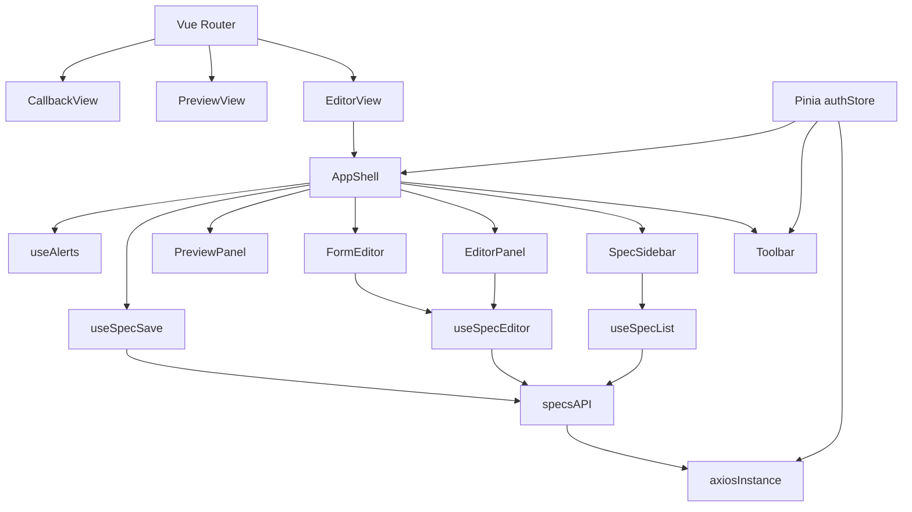
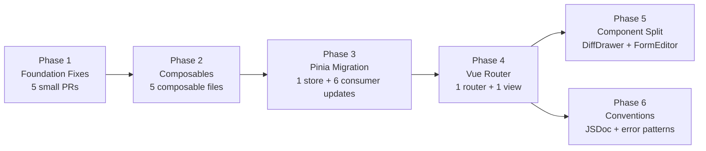

# 🤖 FastSpec Frontend — Maintainability Plan for AI Agent Feature Implementation

> A structured refactoring roadmap to make the FastSpec frontend **agent-friendly**: clear boundaries, composable logic, typed contracts, and isolated responsibilities so AI agents can implement new features without breaking existing ones.

---

## 📊 Current State Assessment

### Component Size Reality Check

| File | Lines | Problem |
|------|-------|---------|
| [`frontend/src/components/DiffDrawer.vue`](frontend/src/components/DiffDrawer.vue) | 3465 | Massive — inline mode + drawer mode + details dialog all in one |
| [`frontend/src/components/FormEditor.vue`](frontend/src/components/FormEditor.vue) | 3287 | Massive — all tabs, all dialogs, all drag-drop logic in one |
| [`frontend/src/App.vue`](frontend/src/App.vue) | 784 | God component — auth, save, diff, alerts, view routing |
| [`frontend/src/components/SpecList.vue`](frontend/src/components/SpecList.vue) | 584 | Mixed — list + version drawer + history compare in one |

### Critical Structural Problems

```
❌ No Vue Router (vue-router is installed but unused — main.js uses URL hack)
❌ No Pinia (module-level refs act as fragile global singleton store)
❌ No composables layer (all logic lives inside component setup() functions)
❌ No TypeScript / JSDoc contracts (agents cannot infer data shapes)
❌ Dead code in SpecList.vue (updateVersionDropdown, onVersionChange, selectedSpec)
❌ updateSpecVersion declared before imports in specs.js
❌ Dynamic imports inside saveSpec() on every save call
❌ Two onMounted() calls in App.vue setup()
❌ Debug console.log/console.groupCollapsed left in DiffDrawer.vue (production noise)
❌ Inline styles scattered across templates
```

---

## 🏗️ Target Architecture



---

## 🚦 Phase 1 — Foundation Fixes
> Surgical, low-risk. Each item is independently mergeable. Required before any agent can reliably add features.

### 1.1 Fix [`frontend/src/api/specs.js`](frontend/src/api/specs.js:1) — Declaration Order Bug

**Problem:** [`updateSpecVersion`](frontend/src/api/specs.js:1) is declared on line 1, before `import axios` and before the `api` Axios instance exists. This is a fragile ES module hoisting coincidence.

**Fix:** Move `updateSpecVersion` to after the `api` instance creation (after line 14).

```js
// BEFORE (broken order)
export const updateSpecVersion = async (specId, versionId, payload) => {
  const response = await api.put(...); // api doesn't exist yet!
};
import axios from "axios";
const api = axios.create({ baseURL: API_BASE });

// AFTER (correct order)
import axios from "axios";
const api = axios.create({ baseURL: API_BASE });
// ... interceptors ...
export const updateSpecVersion = async (specId, versionId, payload) => {
  const response = await api.put(`/${specId}/versions/${versionId}`, payload);
  return response.data;
};
```

**Agent instruction:** Move the 5-line `updateSpecVersion` function block to the bottom of the file, after all other exports.

---

### 1.2 Remove Dead Code from [`frontend/src/components/SpecList.vue`](frontend/src/components/SpecList.vue:240)

**Problem:** Four dead symbols are defined but never used or exposed from `setup()`:
- `updateVersionDropdown()` — references undefined `versionDropdownOptions` and `selectedVersion`
- `onVersionChange()` — references undefined `selectedSpec`
- `versionDropdownOptions` — never declared
- `selectedSpec` — never declared

**Fix:** Delete lines 240–264 entirely (the `updateVersionDropdown` and `onVersionChange` functions).

**Agent instruction:** Remove the `updateVersionDropdown` and `onVersionChange` function bodies from `SpecList.vue`. They are never called and reference undeclared variables.

---

### 1.3 Merge Duplicate `onMounted` in [`frontend/src/App.vue`](frontend/src/App.vue:166)

**Problem:** Two separate `onMounted()` calls in the same `setup()` function. While Vue supports this, it creates ordering confusion and makes it hard for an agent to know where to add new initialization logic.

**Fix:**
```js
// BEFORE
onMounted(() => { initAuth(); });       // line 166
// ... 90 more lines ...
onMounted(() => { fetchOpenApiFile(); }); // line 263

// AFTER
onMounted(async () => {
  initAuth();
  await fetchOpenApiFile();
});
```

---

### 1.4 Remove Debug `console.log` Statements from [`frontend/src/components/DiffDrawer.vue`](frontend/src/components/DiffDrawer.vue:1742)

**Problem:** ~80 lines of `console.log`, `console.groupCollapsed`, `console.warn`, and `console.debug` are left in production code inside computed properties and watchers. This pollutes the browser console, confuses agents reading the code, and wastes CPU on every diff update.

**Fix:** Delete all `console.*` calls from:
- The large `watch([addedEndpoints, modifiedEndpoints, ...])` watcher (lines 1732–1858)
- The `[filter, endpoints]` watcher (lines 1862–1881)  
- The `addedSchemas`, `modifiedSchemas`, `removedSchemas` computed properties

**Agent instruction:** Search for all `console.log`, `console.groupCollapsed`, `console.warn`, `console.debug` in `DiffDrawer.vue` and remove them. Keep the watcher logic itself, only remove logging.

---

### 1.5 Remove Dynamic Imports from [`frontend/src/App.vue`](frontend/src/App.vue:404)

**Problem:** `saveSpec()` uses `await import("./api/specs")` three times inside the function body. The module is already statically imported at the top. This forces a module-system round-trip on every save.

**Fix:** Add `createSpecVersion`, `updateSpecVersion`, `listSpecVersions` to the static import at line 136:
```js
// BEFORE
import { validateSpec, createSpec, updateSpec } from "./api/specs";

// AFTER
import {
  validateSpec, createSpec, updateSpec,
  createSpecVersion, updateSpecVersion, listSpecVersions,
} from "./api/specs";
```
Then remove all three `await import(...)` calls inside `saveSpec`.

---

## 🔧 Phase 2 — Composables Extraction
> Break logic out of components into reusable, testable composables. This is the single biggest unlock for AI agents: each feature area becomes a well-bounded file with a clear input/output contract.

### 2.1 Create `useAlerts` Composable

**New file:** [`frontend/src/composables/useAlerts.js`](frontend/src/composables/useAlerts.js)

**Extracts from:** [`frontend/src/App.vue`](frontend/src/App.vue:267) — `showAlert`, `closeAlert`, `alert` ref

```js
// frontend/src/composables/useAlerts.js
import { ref } from "vue";

export function useAlerts() {
  const alert = ref({ show: false, message: "", type: "info" });

  const showAlert = (message, type = "info") => {
    alert.value = { show: true, message, type };
    setTimeout(() => { alert.value.show = false; }, 5000);
  };

  const closeAlert = () => { alert.value.show = false; };

  return { alert, showAlert, closeAlert };
}
```

**Agent instruction:** Any feature that needs to show success/error messages should import and call `useAlerts().showAlert(message, type)`. Do not add new alert state to components directly.

---

### 2.2 Create `useSpecEditor` Composable

**New file:** [`frontend/src/composables/useSpecEditor.js`](frontend/src/composables/useSpecEditor.js)

**Extracts from:** [`frontend/src/App.vue`](frontend/src/App.vue:170) — `specContent`, `parsedSpec`, `initialSpec`, `hasUnsavedChanges`, `updatePreview`, `updateFromForm`, `loadSpec`, `newSpec`, `loadTemplate`, `getDefaultSpec`

```js
// frontend/src/composables/useSpecEditor.js
import { ref, computed } from "vue";
import { compareSpecs } from "../utils/diffUtils";

export function useSpecEditor() {
  const currentSpec = ref(null);
  const specContent = ref(JSON.stringify(getDefaultSpec(), null, 2));
  const parsedSpec = ref(getDefaultSpec());
  const initialSpec = ref(getDefaultSpec());
  const hasUnsavedChanges = ref(false);

  // ... all editor logic ...

  return {
    currentSpec, specContent, parsedSpec,
    initialSpec, hasUnsavedChanges,
    updatePreview, updateFromForm, loadSpec, newSpec, loadTemplate,
  };
}
```

**Agent instruction:** To add a new editing capability (e.g. YAML import, AI-assisted fill), add a new method to `useSpecEditor` and expose it from `setup()`. Do not add spec mutation logic to `App.vue` directly.

---

### 2.3 Create `useSpecSave` Composable

**New file:** [`frontend/src/composables/useSpecSave.js`](frontend/src/composables/useSpecSave.js)

**Extracts from:** [`frontend/src/App.vue`](frontend/src/App.vue:377) — `saveSpec`, `openSaveDialog`, `showSaveDialog`, `validateCurrentSpec`

```js
// frontend/src/composables/useSpecSave.js
import { ref } from "vue";
import {
  createSpec, updateSpecVersion, createSpecVersion, listSpecVersions,
} from "../api/specs";

export function useSpecSave({ specContent, currentSpec, initialSpec, hasUnsavedChanges, showAlert, isAuthenticated }) {
  const showSaveDialog = ref(false);
  const saving = ref(false);

  const openSaveDialog = () => { ... };
  const saveSpec = async (payloadOrName) => { ... };

  return { showSaveDialog, saving, openSaveDialog, saveSpec };
}
```

**Agent instruction:** To add new save destinations (e.g. export to file, push to Git), add a new method to `useSpecSave`. The composable accepts `specContent` and `currentSpec` as inputs so it is fully decoupled from the editor.

---

### 2.4 Create `useOpenApiDiff` Composable

**New file:** [`frontend/src/composables/useOpenApiDiff.js`](frontend/src/composables/useOpenApiDiff.js)

**Extracts from:** [`frontend/src/App.vue`](frontend/src/App.vue:195) — `fetchOpenApiFile`, `openapiFileRaw`, `openapiBaseline`, `openapiFileDiff`, `openapiFileHasChanges`, `formattedOpenapiFileDiff`, `copyOpenapiFileDiff`

**Agent instruction:** To add new diff display modes or export formats, modify only `useOpenApiDiff`. The composable is isolated from auth and save logic.

---

### 2.5 Create `useSpecList` Composable

**New file:** [`frontend/src/composables/useSpecList.js`](frontend/src/composables/useSpecList.js)

**Extracts from:** [`frontend/src/components/SpecList.vue`](frontend/src/components/SpecList.vue:204) — `specs`, `loading`, `error`, `loadSpecs`, `selectSpec`, `confirmDelete`, `expanded`, `toggleExpand`, `formatRelativeTime`, version-related state

**After extraction, `SpecList.vue` becomes:**
- Template only: render the list, emit events
- `setup()` calls `useSpecList()` and wires events
- Target: under 200 lines

---

## 🏛️ Phase 3 — State Management Migration to Pinia
> Replaces the fragile module-level singleton with proper scoped stores.

### 3.1 Install and Bootstrap Pinia

```bash
# Already installed — just not used
# Add to main.js:
import { createPinia } from 'pinia'
app.use(createPinia())
```

**File:** [`frontend/src/main.js`](frontend/src/main.js)

### 3.2 Migrate Auth to Pinia Store

**New file:** [`frontend/src/stores/auth.js`](frontend/src/stores/auth.js) (replace current content)

```js
// frontend/src/stores/auth.js
import { defineStore } from 'pinia';

export const useAuthStore = defineStore('auth', {
  state: () => ({
    user: null,
    token: null,
    apiKey: null,
    isLoading: false,
  }),
  getters: {
    isAuthenticated: (state) => !!state.token && !!state.user,
  },
  actions: {
    setAuth(token, user, apiKey = null) { ... },
    clearAuth() { ... },
    initAuth() { ... },
  },
});
```

**Why this matters for agents:** Pinia stores are self-contained, testable, and DevTools-visible. An agent adding a new feature that needs auth state imports `useAuthStore()` — there is no ambiguity about where state lives.

**Migration steps:**
1. Replace `useAuth()` import with `useAuthStore()` in all consumers:
   - [`frontend/src/App.vue`](frontend/src/App.vue:163)
   - [`frontend/src/components/Toolbar.vue`](frontend/src/components/Toolbar.vue:60)
   - [`frontend/src/api/specs.js`](frontend/src/api/specs.js:19)
   - [`frontend/src/components/LoginPage.vue`](frontend/src/components/LoginPage.vue)
   - [`frontend/src/components/UserProfile.vue`](frontend/src/components/UserProfile.vue)
   - [`frontend/src/components/OAuthCallback.vue`](frontend/src/components/OAuthCallback.vue)

---

## 🛣️ Phase 4 — Vue Router Integration
> `vue-router` is already installed but unused. [`main.js`](frontend/src/main.js:13) uses a URL query-param hack to decide which component to render. This must be replaced.

### 4.1 Create Router Configuration

**New file:** [`frontend/src/router/index.js`](frontend/src/router/index.js)

```js
import { createRouter, createWebHistory } from 'vue-router';
import EditorView from '../views/EditorView.vue';
import OAuthCallback from '../components/OAuthCallback.vue';

const routes = [
  { path: '/', component: EditorView },
  { path: '/auth/callback', component: OAuthCallback },
  // Future routes agents can add:
  // { path: '/specs/:id', component: SpecDetailView },
  // { path: '/preview', component: PreviewView },
];

export const router = createRouter({
  history: createWebHistory(),
  routes,
});
```

### 4.2 Create `EditorView`

**New file:** [`frontend/src/views/EditorView.vue`](frontend/src/views/EditorView.vue)

This is the content currently in `App.vue` template — the main layout with toolbar, spec list, and editor panels. `App.vue` becomes a pure shell:

```vue
<!-- App.vue after refactor -->
<template>
  <RouterView />
  <Toast />
</template>
```

### 4.3 Update `main.js`

**Remove** the URL-param hack (lines 13–17) and replace with:
```js
import { router } from './router/index.js';
app.use(router);
```

**Why this matters for agents:** Adding a new page/view is now a single router entry + a new `.vue` file in `views/`. No agent needs to touch `App.vue` or `main.js`.

---

## 📐 Phase 5 — Split Oversized Components

### 5.1 Split [`frontend/src/components/DiffDrawer.vue`](frontend/src/components/DiffDrawer.vue) (3465 lines → 3 files)

| New File | Responsibility | Est. Lines |
|----------|---------------|------------|
| [`DiffPanel.vue`](frontend/src/components/DiffPanel.vue) | Shared summary pills, search, section lists | ~400 |
| [`DiffDrawer.vue`](frontend/src/components/DiffDrawer.vue) | Drawer wrapper, uses `DiffPanel` | ~80 |
| [`DiffInline.vue`](frontend/src/components/DiffInline.vue) | Inline panel wrapper, uses `DiffPanel` | ~60 |
| [`ChangeDetailDialog.vue`](frontend/src/components/ChangeDetailDialog.vue) | The details Dialog — endpoint/schema/info/server display | ~400 |

**Current problem:** The `inline` boolean prop causes the entire template to be duplicated (~500 lines repeated twice). Extract shared rendering into `DiffPanel` and use it in both modes.

**Agent instruction:** To add a new change category to the diff view (e.g. security schemes, webhooks), add it to `DiffPanel.vue` only. `DiffDrawer.vue` and `DiffInline.vue` do not need to change.

---

### 5.2 Split [`frontend/src/components/FormEditor.vue`](frontend/src/components/FormEditor.vue) (3287 lines → 5 files)

| New File | Responsibility | Est. Lines |
|----------|---------------|------------|
| [`FormEditor.vue`](frontend/src/components/FormEditor.vue) | Tab container, coordinates sub-editors | ~120 |
| [`InfoTab.vue`](frontend/src/components/editor-tabs/InfoTab.vue) | API info fields | ~100 |
| [`ServersTab.vue`](frontend/src/components/editor-tabs/ServersTab.vue) | Server list editor | ~80 |
| [`PathsTab.vue`](frontend/src/components/editor-tabs/PathsTab.vue) | Paths accordion + method editor | ~800 |
| [`ComponentsTab.vue`](frontend/src/components/editor-tabs/ComponentsTab.vue) | Schema builder | ~600 |
| `useFormEditor.js` | All form state, watchers, drag-drop logic | ~400 |

**Agent instruction:** To add a new top-level OpenAPI section (e.g. `tags`, `externalDocs`, `security`), create a new `*Tab.vue` in `editor-tabs/` and add a `<Tab>` entry in `FormEditor.vue`. No other files need to change.

---

## 📋 Phase 6 — Agent-Friendly Conventions

### 6.1 Add JSDoc Contracts to API Layer

Every exported function in [`frontend/src/api/specs.js`](frontend/src/api/specs.js) should have a JSDoc block:

```js
/**
 * Fetch all specs for the authenticated user.
 * @returns {Promise<Array<{id: number, name: string, version: string, spec_json: object}>>}
 */
export const fetchSpecs = async () => { ... };

/**
 * Compare two versions of a spec.
 * @param {number} specId
 * @param {number} base - version ID
 * @param {number} compare - version ID
 * @returns {Promise<{base: object, compare: object, diff: DiffResult}>}
 */
export const compareSpecVersions = async (specId, base, compare) => { ... };
```

**Why:** Agents use JSDoc to understand return shapes without running the code. This is the cheapest form of type safety.

---

### 6.2 Add `provide/inject` Map Comment to `App.vue`

The current `provide()` calls are scattered and not documented. Add a single block comment:

```js
// ── Provided to child tree ──────────────────────────────────────────────────
// newSpec()           → Toolbar.vue — create blank spec
// openSaveDialog()    → Toolbar.vue — open save dialog
// validateCurrentSpec() → EditorPanel.vue — validate current JSON
// loadTemplate()      → Toolbar.vue — load sample template
// togglePreview()     → Toolbar.vue — switch to preview mode
// viewMode (ref)      → Toolbar.vue, EditorPanel.vue — current view
// refreshSpecList     → SpecList.vue — trigger list reload
// showTokenDialog()   → Toolbar.vue — open token manager
// ────────────────────────────────────────────────────────────────────────────
```

**Agent instruction:** When adding a new action that a child component needs, add both the `provide()` call and a line to this comment block. When adding a new component that needs a provided value, check this block first before creating new state.

---

### 6.3 Standardize Error Handling Pattern

Currently errors are handled inconsistently: some use `showAlert`, some use `console.error`, some silently catch. Define one pattern:

```js
// Pattern for all async operations in composables:
const doSomething = async () => {
  try {
    const result = await apiCall();
    showAlert("Success message", "success");
    return result;
  } catch (error) {
    const message = error.response?.data?.detail || error.message || "Unknown error";
    showAlert(message, "error");
    throw error; // re-throw so callers can react if needed
  }
};
```

**Agent instruction:** All new async operations follow this try/catch/showAlert pattern. Do not add new `console.error` calls without also calling `showAlert`.

---

### 6.4 Remove Inline Styles, Use CSS Classes

All inline `style="..."` attributes in templates should become named CSS classes in `<style scoped>`. This affects primarily:
- [`frontend/src/components/SpecList.vue`](frontend/src/components/SpecList.vue:53) — inline flex styles on version row
- [`frontend/src/components/DiffDrawer.vue`](frontend/src/components/DiffDrawer.vue) — multiple inline styles on detail sections

**Agent instruction:** Never add `style="..."` to a template element. Always add a class and define it in `<style scoped>`.

---

## 🤖 Adding New Features with AI Agents — Decision Guide

Once phases 1–4 are complete, this table guides an agent on where to implement any new feature:

| Feature Type | Where to Add | Files to Touch |
|---|---|---|
| New API endpoint call | [`frontend/src/api/specs.js`](frontend/src/api/specs.js) | 1 file |
| New success/error toast | `useAlerts().showAlert()` | 0 new files |
| New spec editing operation | [`frontend/src/composables/useSpecEditor.js`](frontend/src/composables/useSpecEditor.js) | 1 file |
| New save target | [`frontend/src/composables/useSpecSave.js`](frontend/src/composables/useSpecSave.js) | 1 file |
| New diff category display | [`frontend/src/components/DiffPanel.vue`](frontend/src/components/DiffPanel.vue) | 1 file |
| New form section tab | `editor-tabs/NewTab.vue` + register in `FormEditor.vue` | 2 files |
| New page/view | `views/NewView.vue` + router entry | 2 files |
| New auth state property | Pinia `authStore` | 1 file |
| New toolbar action | [`frontend/src/components/Toolbar.vue`](frontend/src/components/Toolbar.vue) + `provide` in `EditorView.vue` | 2 files |
| New sidebar panel | New component + register in `EditorView.vue` | 2 files |

---

## 🗂️ Target File Structure

```
frontend/src/
├── main.js                         ← bootstrap only (router + pinia + primevue)
├── App.vue                         ← shell: <RouterView /> + <Toast />
├── router/
│   └── index.js                    ← route definitions
├── stores/
│   └── auth.js                     ← Pinia auth store (replaces current composable)
├── views/
│   ├── EditorView.vue              ← full editor layout
│   └── (future: SpecDetailView.vue, etc.)
├── composables/
│   ├── useAlerts.js
│   ├── useSpecEditor.js
│   ├── useSpecSave.js
│   ├── useOpenApiDiff.js
│   └── useSpecList.js
├── components/
│   ├── Toolbar.vue
│   ├── SpecList.vue                ← thin, delegates to useSpecList
│   ├── EditorPanel.vue
│   ├── FormEditor.vue              ← tab container only
│   ├── editor-tabs/
│   │   ├── InfoTab.vue
│   │   ├── ServersTab.vue
│   │   ├── PathsTab.vue
│   │   └── ComponentsTab.vue
│   ├── DiffPanel.vue               ← shared diff rendering
│   ├── DiffDrawer.vue              ← drawer wrapper
│   ├── DiffInline.vue              ← inline wrapper
│   ├── ChangeDetailDialog.vue
│   ├── PreviewPanel.vue
│   ├── SaveDialog.vue
│   ├── LoginPage.vue
│   ├── OAuthCallback.vue
│   ├── TokenManager.vue
│   └── UserProfile.vue
├── api/
│   └── specs.js                    ← all API calls, JSDoc typed
└── utils/
    ├── diffUtils.js
    └── markdownGenerator.js
```

---

## 📅 Execution Order



Phases 5 and 6 can run in parallel once Phase 4 is done.

---

## ✅ Definition of Done

Each phase is complete when:
- [ ] No component `setup()` function exceeds 150 lines
- [ ] No `.vue` file exceeds 400 lines
- [ ] All async operations follow the try/catch/showAlert pattern
- [ ] No `console.log` in production code paths
- [ ] No inline `style="..."` in templates
- [ ] Every exported function in `api/specs.js` has a JSDoc `@returns` annotation
- [ ] `vue-router` routes the app (no URL-param hacks in `main.js`)
- [ ] Pinia replaces module-level `ref()` state in `stores/auth.js`
- [ ] Adding a new feature touches at most 2 files
